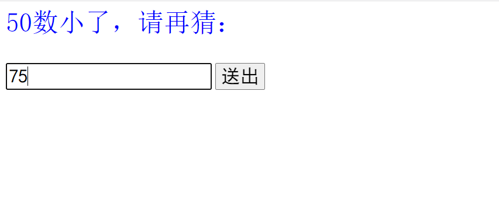

## 1.JSP语法

---

### 1.1  JSP页面的基本结构

**一个JSP页面由==5种元素==组成**

1) **普通的HTML标记和JavaScript标记。**

2)  **JSP标记，如指令标记、动作标记。**

3) **变量和方法的声明。**

4) **Java 程序片。**

5) **Java 表达式**

   

**原理**

- **一个JSP页面被第一次请求执行时，Tomcat服务器首先将JSP页面文件转译成一个Java文件，再将这个Java文件编译生成字节码文件，然后通过执行字节码文件响应用户的请求。**

- **当多个用户请求一个JSP页面时，Tomcat服务器为每个用户启动一个线程，该线程负责执行常驻内存的字节码文件来响应相应用户的请求。这些线程由Tomcat服务器来管理，将CPU的使用权在各个线程之间快速切换，以保证每个线程都有机会执行字节码文件。**

  

### 1.2 声明变量和定义方法

**==<%!......%>==**

**在<%!和%>标记符号之间声明变量，定义方法以及定义类。**

**<%!和%>标记符号的内容习惯上放在JSP 页面指令之后，<HTML>之前，也可以写在<HTML>与</HTML>之间。**

- **<%!和%>之间声明的变量在==整个JSP页面内都有效==，与标记符在JSP页面中所在的书写位置无关，但习惯上把<%!、%> 标记符写在JSP页面的前面。**
- **对于在“<%!”和“%>”标记符号之间==定义方法，可以在Java程序片中调用该方法==。方法内声明的变量只在该方法内有效，当方法被调用时，方法内声明的变量被分配内存，方法被调用完毕即可释放这些变量所占的内存。**
- **对于在“<%!”和“%>”标记符号之间==定义类==，可以==在Java程序片中使用该类创建对象==**


### 1.3 Java 程序片

**==<%... ...%>==**

- **可以在<%和%>之间插入Java 程序片。**
- **一个JSP页面==可以有许多程序片==，这些程序片将被Tomcat服务器按顺序执行。**
- **在程序片中声明的变量称作JSP页面的==局部变量==。局部变量的有效范围与其声明的位置有关，即局部变量<u>在JSP页面后继的所有程序片以及表达式部分内都有效</u>。**

*■当多个用户请求一个JSP页面时，Tomcat服务器为每个用户启动一个线程，该线程负责执行字节码文件响应用户的请求。Tomcat服务器使用多线程来处理程序片.*


### 1.4 Java 表达式

**==<%= …  …%>==**

​	**可以在<%=和%>之间插入一个可求值的表达式**（*注意：不可插入语句，<%=是一个完整的符号，“<%”和“=”之间不要有空格*）。

- **表达式的值由服务器负责计算，并将计算结果用字符串形式发送到用户端显示。**
- **Java表达式可以写在<HTML>之前，也可以写在<HTML>和</HTML>之间或</HTML>之后。**

*●在JSP页面中，表达式的值被表示成一个字符串的形式，即Tomcat服务器将表达式的结果转换成字符串，然后发送给用户的浏览器。因此，在编写JSP页面时，要把Java表达式按普通的文本来使用。*


### 1.5 JSP中的注释

==\<!--注释内容-->==

**HTML注释：在标记符号“\<!--”和“-->”之间加入注释内容**

*JSP引擎把HTML注释交给用户，因此用户通过浏览器查看JSP页面的源文件时，能够看到HTML注释。*


==\<%--注释内容--%>==

 **JSP 注释：在标记符号“<%--”和“--%>”之间加入注释内容**

*Tomcat服务器忽略JSP注释，即在编译JSP页面时忽略JSP注释。*


### 1.6 JSP 指令标记

#### 1.6.1 page 指令标记

**page 指令用来定义整个JSP页面的一些属性和这些属性的值。**

```jsp
<%@ page   属性1="属性1的值"  %>
<%@ page   属性2="属性2的值"  %>
... ...
<%@ page   属性n="属性n的值"  %>
```

**也可以用一个page指令指定多个属性的值，如：**

```jsp
<%@ page   属性1="属性1的值"  属性2= "属性2的值"  ……%>
```

**page指令的作用对整个JSP页面有效，与其书写的位置无关。习惯上把page指令写在JSP页面的最前面**

**page 指令标记可以指定属性：**

==contentType、import、language、session、buffer、auotFlush 、isThreadSafe、pageEncoding 、inform==

##### （1）contentType属性

**JSP页面设置响应的MIME（Multipurpose Internet Mail Extention）类型，即设置contentType 属性的值。contentType属性值确定JSP页面响应的MIME类型。**

```jsp
<!--例如-->
<%@ page contentType="text/html " %>
<!--浏览器启用HTML解析器来解析执行所接收到的信息。-->


<!--如果希望用户的浏览器启用本地的MS-Word应用程序来解析执行收到的信息，就可以如下设置contentType属性的值：-->
<%@ page contentType="application/msword" %>
```

-  可以使用page指令为contentType 属性指定的值有：text/html、text/plain、image/gif、 image/x-xbitmap、image/jpeg、image/pjpeg、application/x-shockwave-flash、application/vnd.ms-powerpoint、 application/vnd.ms-excel、application/msword等
- page指令只能为contentType指定一个值，==不允许两次使用page指令给contentType属性指定不同的属性值==
-  用page指令为contentType指定一个值的同时，也可以为contentType的附加属性charset指定一个值（默认值是iso-8859-1），例如

```jsp
<%@ page contentType="text/html;charset=gb2312" %>
```

> ​		contentType的附加属性charset的值是通知用户浏览器用怎样的编码解析收到的字符， 当JSP页面用page指令指定设置charset的值是gb2312时，浏览器会将编码切换成gb2312。但是，如果JSP页面用page指定了JSP的页面本身的编码，例如：<%@ page pageEncoding = "utf-8" %>，那么charset的值和JSP的页面编码保持一致，即也是utf-8（目前的浏览器都支持utf-8编码，所以一般不需要再指定charset的值，使其和JSP的页面编码保持一致即可）

##### **（2）pageEncoding 属性**

​		**pageEncoding 属性值是定义 JSP 页面使用的编码，即是告诉Tomcat服务器的解析器用怎样的编码解析JSP中的字符**

​		**只能为pageEncoding指定一个值，不允许两次使用page指令给pageEncoding属性指定不同的或相同的属性值。==默认值是 UTF-8==**

```jsp
<!--例如-->
<%@ page pageEncoding = "utf-8" %>
那么保存JSP页面应当将“编码”选择为“utf-8
```

##### （3）language属性

**language属性定义JSP页面使用的脚本语言，该属性的值目前==只能取"java"==。==默认值为 java==**

```jsp
<%@ page  language="java" %>
```

##### （4）import 属性

**该属性的作用是为JSP页面引入Java运行环境提供的包中的类。**

```jsp
<!--例如-->
<%@ page  import="java.io.*", "java.time.LocalDate" %>
<%@ page  import="java.util.*" %>
<%@ page  import="java.io.*"  %>
```

 **==JSP页面默认import属性已经有如下的值：==**

 - ​	**" java.lang.*"**
 - ​	 **"javax.servlet.*"**
 - ​	**"javax.servlet.jsp.*"**
 - ​	**"javax.servlet.http.*"**

##### （5）session属性

**session 属性用于设置是否需要使用内置的session对象。session的属性值可以是true或false。==session属性默认的属性值是true==。**

##### （6）buffer属性

**内置输出流对象out负责将服务器的某些信息或运行结果发送到用户端显示。buffer属性用来指定out设置的缓冲区的大小或不使用缓冲区。==buffer属性的默认值是8kb==** 

```jsp
<!--例如-->
<%@ page buffer= "24kb" %>
```

##### （7）autoFlush属性

**autoFlush属性指定out的缓冲区被填满时，缓冲区是否自动刷新。autoFlush可以取值true或false。==autoFlush属性的默认值是true==。**

##### （8）isThreadSafe 属性

**isThreadSafe 属性用赖设置访问 JSP 页面是否是线程安全**

**isThreadSafe的属性值可取true或false。==默认值 为 true==**

- 为true时，CPU的使用权在各个线程间快速切换
- 为false时，该JSP页面同一时刻只能响应一个用户的请求，其他用户须排队等待。也就是说，CUP要保证一个线程将JSP页面执行完毕才会把CPU使用权切换给其他线程。

##### （9）info 属性

**info属性的属性值是一个字符串，其目的是为JSP页面准备一个常用但可能要经常修改的字符串。**

```jsp
<!--例如-->
<%@ page info= "we are students" %>
<!--
    可以在JSP页面中使用方法：
    getServletInfo();
    获取info属性的属性值
-->
```


#### 1.6.2 include 指令标记

**如果需要在JSP页面内某处整体嵌入一个文件，就可以考虑使用include指令标记，其语法格式如下：**

```jsp
<%@ include file= "文件的URL " %>
```

- ==嵌入的文件的编码必须和当前JSP页面一致==，比如二者都是utf-8编码。
- 所谓静态嵌入，就是当前JSP页面和嵌入的文件合并成一个新的JSP页面，然后Tomcat服务器再将这个新的JSP页面转译成Java文件。因此，嵌入文件后，必须保证新合并成的JSP页面符合JSP语法规则，即能够成为一个JSP页面文件。
- ==include指令可以实现代码的复用==。比如，每个JSP页面上都可能都需要一个导航条，以便用户在各个JSP页面之间方便地切换，那么每个JSP页面都可以使用include指令在页面的适当位置整体嵌入一个相同的文件。
- 允许被嵌入的文件使用page指令指定contentType属性的值，但==指定的值要与嵌入该文件的JSP页面中的====page指令指定的contentType属性的值相同==

------

*例子*

```jsp
<!--ok.txt-->
<%@ page language="java" contentType="text/html; charset=UTF-8"
    pageEncoding="UTF-8"%>
<center>
<A href="example2_10_a.jsp">北京大学</A>
<A href="example2_10_b.jsp">清华大学</A>
```

```jsp
<!--example2_10_a.jsp-->
<%@ page language="java" contentType="text/html; charset=UTF-8"
    pageEncoding="UTF-8"%>
<%@ include file="myfile/ok.txt" %>
<!DOCTYPE html>
<html>
<head>
<meta charset="UTF-8">
<title>example2_10_a.jsp</title>
</head>
<body background="image/beida.jpg">
	<center>
		<bgsound src="sound/beida.mp3" loop="1">
		<h1>这里是北京大学</h1>
	</center>
</body>
</html>
```

```jsp
<!--example2_10_b.jsp-->
<%@ page language="java" contentType="text/html; charset=UTF-8"
    pageEncoding="UTF-8"%>
<%@ include file="myfile/ok.txt" %>
<!DOCTYPE html>
<html>
<head>
<meta charset="UTF-8">
<title>example2_10_b.jsp</title>
</head>
<body background="image/tsinghua.jpg">
	<center>
		<bgsound src="sound/tsinghua.mp3" loop="1">
		<h1>这里是清华大学</h1>
	</center>
</body>
</html>
```


------


### 1.7 JSP 动作标记

**动作标记是一种特殊的标记，它影响JSP运行时的功能。**

#### 1.7.1 include 动作标记

include 动作标记语法格式为：

```jsp
<jsp:include page= "文件的URL" />
```

或

```jsp
<jsp:include page= "文件的URL" >
   param子标记
</jsp:include>
```

**==注意：==当 include 动作标记不需要 param 子标记时，必须使用第一种形式**

> ​		include动作标记告诉JSP页面动态包含一个文件，即JSP页面运行时才将文件加入。与静态嵌入文件的include指令标记不同，当Tomcat服务器根据JSP页面产生成Java文件时，不把JSP页面中动作指令include所包含的文件与原JSP页面合并为一个新的JSP页面，而是告诉Java解释器，这个文件在JSP运行（Java文件的字节码文件被加载执行）时才包含进来。如果包含的文件是普通的文本文件，就将文件的内容发送到用户端，由用户端的浏览器负责显示；如果包含的文件是JSP文件，Tomcat服务器就执行这个文件，然后将执行的结果发送到用户端，并由用户端的浏览器负责显示这些结果。

#### 1.7.2 param 动作标记

**param标记以“名字—值”对的形式为其他标记提供附加信息。**

```jsp
<jsp:param  name= "参数"  value= " 参数的值" />
```

**==注意：==param 标记不能独立使用，必须作为 jsp:include、jsp:foward 标记的子标记来使用**

---

*例子*

```jsp
<!--example2_11.jsp-->
<%@ page language="java" contentType="text/html; charset=UTF-8"
    pageEncoding="UTF-8"%>
<!DOCTYPE html>
<html>
<head>
<meta charset="UTF-8">
<title>example2_11</title>
</head>
<body bgcolor="cyan">
	<%
		double a = 6.12, b = 7, c = 9.22;
	%>
	<p style="font-family: 微软雅黑; font-size: 36;">
		<br>加载 triangle.jsp 计算三边为<%= a %>, <%= b %>, <%= c %>的三角形面积
		<jsp:include page="myfile/triangle.jsp">
		<jsp:param value="<%= a %>" name="sideA"/>
		<jsp:param value="<%= b %>" name="sideB"/>
		<jsp:param value="<%= c %>" name="sideC"/>
		</jsp:include>
	</p>
</body>
</html>
```

```jsp
<!--triangle.jsp-->
<%@ page contentType="text/html" %> 
<%@ page pageEncoding = "utf-8" %>
<%! public String getArea(double a,double b,double c) {
       if(a+b>c&&a+c>b&&c+b>a) {
           double p=(a+b+c)/2.0;
           double area=Math.sqrt(p*(p-a)*(p-b)*(p-c)) ;
           String result = String.format("%.2f",area);//保留两位小数
           return result;
       }
       else { 
          return(""+a+","+b+","+c+"不能构成一个三角形,无法计算面积");
       }
    }
%>
<%   String sideA=request.getParameter("sideA");
     String sideB=request.getParameter("sideB");
     String sideC=request.getParameter("sideC");
     double a=Double.parseDouble(sideA);
     double b=Double.parseDouble(sideB);
     double c=Double.parseDouble(sideC);
%>
<p style="font-family:黑体;font-size:36;color:blue">
<br><b>我是被加载的文件,负责计算三角形的面积<br>
    给我传递的三边是:<%=sideA%>,<%=sideB%>,<%=sideC%></b>
<br><b><i>三角形的面积(保留2位小数):<%= getArea(a,b,c)%></i></b></i>
</p>

```


---


#### 1.7.3 forward 动作标记

```jsp
<jsp:forward page="要转向的页面" />
```

或

```jsp
<jsp:forward page="要转向的页面" >
   param子标记
</jsp:forward>
```

> ​		指令的作用是：从该指令处停止当前页面的执行，而转向执行page属性指定的JSP页面。需要注意的是，当前页面使用forward动作标记转向后，尽管用户看到了转向后的页面的效果，但浏览器地址栏中显示的仍然是转向前的JSP页面的URL地址，因此，如果刷新浏览器的显示，将再次执行当前浏览器地址栏中显示的JSP页面。

---

*例子*

```jsp
<!--example2_12.jsp-->
<%@ page language="java" contentType="text/html; charset=UTF-8"
    pageEncoding="UTF-8"%>
<!DOCTYPE html>
<html>
<head>
<meta charset="UTF-8">
<title>example2_12.jsp</title>
</head>
<body>
	<h1>产生一个1~10之间的随机数
	<%
		double i = (int)(Math.random()*10)+1;
		if(i <= 5){		
	%>		<jsp:forward page="example2_12_a.jsp">
				<jsp:param value="<%= i %>" name="number"/>
			</jsp:forward>
	<%	}else{
	%>		<jsp:forward page="example2_12_b.jsp">
				<jsp:param value="<%= i %>" name="number"/>
			</jsp:forward>
	<%	}
	%>
	</h1>
</body>
</html>
```

```jsp
<!--example2_12_a.jsp-->
<%@ page language="java" contentType="text/html; charset=UTF-8"
    pageEncoding="UTF-8"%>
<!DOCTYPE html>
<html>
<head>
<meta charset="UTF-8">
<title>example2_12_a.jsp</title>
</head>
<body bgcolor="cyan">
	<p style="font-family: 微软雅黑; font-size: 36">
	<%
		String s = request.getParameter("number");
		out.println("传递过来的值是" + s);
	%>
	<br>
	</p>
</body>
</html>
```

```jsp
<!--example2_12_b.jsp-->
<%@ page language="java" contentType="text/html; charset=UTF-8"
    pageEncoding="UTF-8"%>
<!DOCTYPE html>
<html>
<head>
<meta charset="UTF-8">
<title>example2_12_b.jsp</title>
</head>
<body bgcolor="yellow">
	<p style="font-family: 微软雅黑; font-size: 36">
	<%
		String s = request.getParameter("number");
		out.println("传递过来的值是" + s);
	%>
	<br>
	</p>
</body>
</html>
```


---


## 2.Tag文件与Tag标记

---

### 2.1 Tag 文件

**Tag文件和JSP文件很类似，可以被JSP页面动态加载调用，实现代码的复用（但用户不能通过该Tag文件所在Web服务目录直接访问Tag文件）**

#### 2.1.1 Tag 文件的结构

Tag文件是扩展名为.tag的文本文件，其结构和JSP文件类似。

一个Tag文件中可以有普通的HTML标记符、某些特殊的指令标记、成员变量声明和方法的定义、Java程序片和Java表达式。

#### 2.1.2 Tag 的保存

**建立目录结构：Web服务目录\WEB-INF\tags**

比如：ch3\WEB-INF\tags

其中的W**EB-INF（字母大写）和tags都是固定的目录名称**，而t**ags下的子目录的名称可由用户给定**

**==一个Tag文件必须保存到tags目录或其下的子目录中==**


### 2.2 Tag 标记

Tag标记的名字和Tag文件的名字一致，也就是说，当我们编写了一个Tag文件并保存到特定目录中后,也就给出了一个Tag标记，

#### 2.2.1 Tag 标记与 Tag 文件

```jsp
<Tag文件名字 />
或
<Tag文件名字 > 其他内容（称为标体内容）</Tag文件名字>
```

一个Tag文件对应着一个Tag标记，把全体Tag标记称之为一个自定义标记库或简称为标记库.

#### 2.2.2 Tag 标记的使用

■JSP页在使用Tag标记来调用一个Tag文件之前，**必须首先使用taglib指令标记**引入该Web服务目录下的标记库，只有这样，JSP页面才可以使用Tag标记调用相应的Tag文件。

taglib指令的格式如下：

```jsp
<%@ taglib tagdir="标记库的位置" prefix="前缀">
```

例如：

```jsp
<%@ taglib tagdir="/WEB-INF/tags" prefix="computer"%>
```

■引入标记库后，JSP页面就可以使用带前缀的Tag标记调用相应的Tag文件，其中的前缀由<taglib>指令中的prefix属性指定。例如JSP如下使用Tag标记调用相应的Tag文件：

```jsp
<computer:oddNumberSum />
```

> ​	taglib 指令中的p==refix 给出的前缀由用户自定义==，其好处是，通过前缀可以有效地区分不同标记库中具有相同名字的标签文件
>
> ​	JSP 页面使用 Tag 标记时，冒号：的左右不要有空格

---

*例子*

```jsp
<!--example3_1.jsp-->
<%@ page language="java" contentType="text/html; charset=UTF-8"
    pageEncoding="UTF-8"%>
<%@ taglib tagdir="/WEB-INF/tags/第3章" prefix="computer"%>
<!DOCTYPE html>
<html>
<head>
<meta charset="UTF-8">
<title>example3_1.jsp</title>
</head>
<body bgcolor="cyan">
	<h1>调用 Tag 文件计算 100 内奇数和：</h1>
	<computer:oddNumberSum></computer:oddNumberSum>
</body>
</html>
```

```jsp
//oddNumberSum.tag
<%@ tag language="java" pageEncoding="UTF-8"%>
<p style="font-family: 微软雅黑; font-size: 36;">
	1~100内的奇数之和
	<%
		int sum = 0, i = 1;
		for(i=1; i<=100; i++){
			if(i%2==1){
				sum = sum + i;
			}
		}
		out.print(sum);
	%>
</p>
```


---


#### 2.2.3 Tag 标记的运行原理

Tomcat服务器处理JSP页面中的Tag标记的原理如下：

（1）如果该Tag标记对应的Tag文件是首次被JSP页面调用，那么Tomcat服务器会将Tag文件转译成一个java文件，并编译这个java文件生成字节码文件，然后执行这个字节码文件（这和执行JSP页面的原理类似）。

（2）如果该Tag文件已经被转编译为字节码文件，Tomcat服务器将直接执行这个字节码文件。

（3）如果对Tag文件进行了修改，那么Tomcat服务器会重新将Tag文件转译成一个java文件，并编译这个java文件生成字节码文件，然后执行这个字节码文件。


### 2.3 Tag 文件中的常用指令

Tag 文件中经常使用的指令有 tag、taglib、include、attribute、variable

#### 2.3.1 tag 指令

类似于JSP文件中的page指令。Tag文件通过使用tag指令可以指定某些属性的值

```jsp
<%@ tag 属性1="属性值" 属性2="属性值" …属性n="属性值"%>
```

或

```jsp
<%@ tag 属性1="属性值"%>
<%@ tag 属性2="属性值"%>
……
<%@ tag 属性n="属性值"%>
```

- **==language属性== 。只能取值java，==其默认值就是java==，没有必要使用tag指令指定language属性的值。**
- **==import属性==。import属性的作用是为Tag文件引入包中的类import属性默认已经有如下值："java.lang.*"、 "javax.servlet.*"、"javax.servlet.jsp.*"、"javax.servlet.http.*"。**
- **==pageEncoding属性==。该属性指定Tag文件的字符编码，==其默认值是ISO-8859-1==。目前，为了避免显示信息出现乱码现象，Tag文件需要将该属性值设置为utf-8。**

#### 2.3.2 include 指令

Tag文件中也有和JSP文件类似的include指令标记，其使用方法和作用与JSP文件中的include指令标记类似。

#### 2.3.3 attribute 指令

一个Tag文件允许使用它的JSP页面向该Tag文件传递数据。在Tag文件中通过使用==attribute指令==让使用它的JSP页面向该Tag文件传递需要的数据。

**数据：xxx.jsp   --->  xxx.tag** 

```jsp
<%@ attribute name="对象名字" required="true"|"false" type="对象的类型"%>
```

- **name 属性是必选的，该属性值是一个对象的名字**
- **type在指定对象类型时，必须使用包名，如 java.lang.Double ，默认值为 java.lang.String**
- **required 属性是可选的，默认值为 false。但值为true时，则调用该 Tag 文件的 JSP 文件必须向该 Tag 文件传递数据**

> 注意：
>
> ​		在 Tag 文件中不可以再定义和 attribute 指令中的 name 属性给出的对象具有相同名字的变量，否则将隐藏 attribute 指令中给出的对象，使其失效。


*例如*

```jsp
<!--xxx.tag-->
<%@ attribute name="result" required="true" type="java.lang.Double"%>
<%-- 
那么就相当于Tag文件中有了一个名字是result的对象，但Tag文件不需要创建该对象result，而是等待JSP页面将一个Double型的对象的引用传递给result
--%>
```

JSP页面使用Tag标记向所调用的Tag文件中name指定的对象传递一个引用，方式如下：

```jsp
<!--xxx.jsp-->
<前缀：Tag文件名字 对象名字="对象的引用" />
```

---

*例子*

```jsp
<!--example3_2.jsp-->
<%@ page language="java" contentType="text/html; charset=UTF-8"
    pageEncoding="UTF-8"%>
<%@ taglib tagdir="/WEB-INF/tags/第3章" prefix="getTriangleArea"%>
<!DOCTYPE html>
<html>
<head>
<meta charset="UTF-8">
<title>example3_2.jsp</title>
</head>
<body bgcolor="yellow">
	<p style="font-family: 微软雅黑; font-size: 36; color: blue;">
	<getTriangleArea:triangle sideA="15" sideB="16" sideC="20"/>
	</p>
</body>
</html>
```

```jsp
<!--triangle.tag-->
<%@ tag language="java" pageEncoding="UTF-8"%>
<%@ attribute name="sideA" required="true"%>
<%@ attribute name="sideB" required="true"%>
<%@ attribute name="sideC" required="true"%>
<%! 
	public String getArea(double a, double b, double c){
		if(a+b > c && a+c > b && b+c >a){
			double p = (a+b+c)/2.0;
			double area = Math.sqrt(p * (p-a) * (p-b) * (p-c));
			String result = String.format("%.2f", area);
			return "<br>三角形面积（小数点保留2位）：" + result; 
		}
		else{
			return "<br>" + a + "," + b + "," + c + "不能构成一个三角形，无法计算面积";
		}
	}
%>
<%
	out.println("<br>三边：" + sideA + "," + sideB + "," + sideC);
	double a = Double.parseDouble(sideA);
	double b = Double.parseDouble(sideB);
	double c = Double.parseDouble(sideC);
	out.println(getArea(a, b, c));
%>
```


---


#### 2.3.4 variable 指令

Tag文件通过使用==variable指令==可以将Tag文件中的对象返回给调用该Tag文件的JSP页面。

**数据：xxx.tag   --->  xxx.jsp** 

```jsp
<%@ variable name-given="对象" variable-class="对象的类型" scope="有效范围"%>
```

- name-given 属性的值就是 Tag 文件返回给 JSP 页面的对象
- variable 属性的值是返回的对象的类型
- scope 属性的值指定对象的有效范围，可以取 AT_BEGIN，NESTED，AT_END。

■Tag文件为了给JSP页面返回一个对象，就必须将返回的对象的名字以及该对象的引用存储到Tomcat服务器提供的内置对象jspContext中。

```tag
jspContext.setAttribute("对象的名字",对象的引用)
```

> 注意：
>
> ​	在 JSP 页面中不可以再定义与 Tag 文件返回的对象具有相同名字的变量，否则 Tag文件无法将 variable 指令给出的对象返回给 JSP 页面。

---

*例子*

```jsp
<!--example3_4.jsp-->
<%@ page language="java" contentType="text/html; charset=UTF-8"
    pageEncoding="UTF-8"%>
<%@ taglib tagdir="/WEB-INF/tags/第3章" prefix="getPrice"%>
<!DOCTYPE html>
<html>
<head>
<meta charset="UTF-8">
<title>example3_4.jsp</title>
</head>
<body bgcolor="#FFCCFF">
	<%
		String str = "麻婆豆腐：20.6元，红烧肉：68.9元，烧鸭：199元";
	%>
	<getPrice:handleData mess="<%= str %>"/>
	<p style="font-size: 微软雅黑; font-size: 36;">
	菜单：<br>"<%= str %>"<br>价格总和：
	<%= price %>
	</p>
	
	<%
		str = "毛巾：2.6元，香皂：6.9元，牙刷：12.3元";
	%>
	<getPrice:handleData mess="<%= str %>"/>
	<p style="font-size: 微软雅黑; font-size: 36;">
	菜单：<br>"<%= str %>"<br>价格总和：
	<%= price %>
	</p>
</body>
</html>
```

```jsp
<!--handleData.tag-->
<%@ tag language="java" pageEncoding="UTF-8"%>
<%@ attribute name="mess" required="true" type="java.lang.String"%>
<%@ tag import="java.util.regex.Pattern"%>
<%@ tag import="java.util.regex.Matcher"%>
<%@ variable name-given="price" variable-class="java.lang.Double" scope="AT_BEGIN"%>
<%!
	public Double getPriceSum(String input){
		Pattern pattern;
		Matcher matcher;
		String regex = "-?[0-9][0-9]*[.]?[0-9]*";
		pattern = Pattern.compile(regex);
		matcher = pattern.matcher(input);
		double sum = 0;
		while(matcher.find()){
			String str = matcher.group();
			sum += Double.parseDouble(str);
		}
		return new Double(sum);
	}
%>
<%
	jspContext.setAttribute("price", getPriceSum(mess));
%>
```


---


#### 2.3.5 taglib 指令

JSP页面或Tag文件都可以使用taglib指令使用标记库（如前面各个例子所示）

```jsp
<%@ taglib tagdir="自定义标记库的位置" prefix="前缀">
```

#### 小结

**数据：xxx.jsp   --->  xxx.tag**  用 attribute 指令

**数据：xxx.tag   --->  xxx.jsp**  用 variable 指令


## 3.JSP 内置对象

---

### 3.1 request 对象

​	HTTP通信协议是用户与服务器之间一种提交（请求）信息与响应信息（request/response）的通信协议。

​	在JSP中，内置对象request封装了用户提交的信息，那么该对象调用相应的方法可以获取封装的信息，即使用该对象可以获取用户提交的信息。

​	内置对象request对象是实现了ServletRequest接口类的一个实例，可以在Tomcat服务器的webapps\tomcat-docs\servletapi中查找ServletRequest接口的方法

#### 3.1.1 获取用户提交的信息

request对象获取用户提交信息的最常用的方法是 **getParameter(String s)**

---

*例子*

```jsp
<!--example3_1.jsp-->
<%@ page language="java" contentType="text/html; charset=UTF-8"
    pageEncoding="UTF-8"%>
<!DOCTYPE html>
<html>
<head>
<meta charset="UTF-8">
<title>example4_1.jsp</title>
</head>
<body bgcolor="#ffccff">
	<form action="example4_1_computer.jsp" method="post">
		<input type="text" name="sizeA" value=9 size=6>
		<input type="text" name="sizeB" value=8 size=6>
		<input type="text" name="sizeC" value=8 size=6>
		<input type="submit" name="submit" value="提交">
	</form>
</body>
</html>
```

```jsp
<!--example4_1_computer.jsp-->
<%@ page language="java" contentType="text/html; charset=UTF-8"
    pageEncoding="UTF-8"%>
<!DOCTYPE html>
<html>
<head>
<meta charset="UTF-8">
<title>example4_1_computer.jsp</title>
</head>
<body bgcolor="#ccffff">
<%
	String sideA = request.getParameter("sizeA");
	String sideB = request.getParameter("sizeB");
	String sideC = request.getParameter("sizeC");
	try{
		double a = Double.parseDouble(sideA);
		double b = Double.parseDouble(sideB);
		double c = Double.parseDouble(sideC);
		double p = (a+b+c)/2, area = 0;
		area = Math.sqrt(p*(p-a)*(p-b)*(p-c));
		String result = String.format("%.2f", area);
		out.println("<br>三边：" + sideA + "," + sideB + "," + sideC);
		out.println("<br>三角形面积（保留2位小数）：" + result);
	}
	catch(NumberFormatException ee){
		out.println("<br>请输入数字字符");		
	}
%>
</body>
</html>
```


---


#### 3.1.2 处理汉字信息

​	用户提交的信息中如果含有汉字字符或其他非ASCII字符的信息，就必须进行特殊的处理方式，防止出乱码现象。


● 处理汉字信息

1. JSP页面文件的编码为utf-8编码。
2. 内置对象request在获取信息之前调用**setCharacterEncoding**方法设置编码为utf-8（默认是iso-8859-1）就可以避免乱码现象

```jsp
request.setCharacterEncoding("utf-8");
```

---

*例子*

```jsp
<!--example4_3.jsp-->
<%@ page language="java" contentType="text/html; charset=UTF-8"
    pageEncoding="UTF-8"%>
<!DOCTYPE html>
<html>
<head>
<meta charset="UTF-8">
<title>example4_3.jsp</title>
<style>
	#tom{
		font-family: 微软雅黑;
		font-size: 26px;
		color: blue;
	}
</style>
</head>
<body id="tom" bgcolor="#ffccff">
	可以输入各种语言的文字，单击提交键：
	<%
	   String content = "早上好,Good morning,อรุณสวัสดิ์ค่ะ(泰语),"+
               " おはよう,Доброе утро,좋은 아침";
	%>
	<form action="" method="post" id="tom">
		<textarea rows="5" cols="32" id="tom" name="language">
			<%= content %>
		</textarea>
		<input type="submit" id="tom" name="submit" value="提交">
	</form>
	<%
		request.setCharacterEncoding("utf-8");
		String variousLanguage = request.getParameter("language");
		out.print(variousLanguage);
	%>
</body>
</html>
```


---


#### 3.1.3 常用方法举例

request的getParameter方法获取form表单提交的有关信息，但实际上，request对象调用相关方法可以获取请求的许多细节信息。内置对象request常用方法如下：

- **String getProtocol()**  获取用户向服务器提交信息所使用的通信协议，比如http/1.1等。
- **String getServletPath()**  获取用户请求的JSP页面文的名字（带目录符号\，例如\hello.jsp）。
- **String getContextPath()** 获取用户请求的当前Web服务目录（例如ch4）。
- **int getContentLength()**  获取用户提交的整个信息的长度。
- **String getMethod()**  获取用户提交信息的方式，比如：post或get.
- **String getRemoteAddr()**  获取用户的IP地址。
- **String getRemoteHost()**  获取用户机的名称（如果获取不到，就获取IP地址）。
- **String getServerName()**  获取服务器的名称。
- **String getServerPort()**  获取服务器的端口号

---

*例子*

```jsp
<!--example4_4.jsp-->
<%@ page language="java" contentType="text/html; charset=UTF-8"
    pageEncoding="UTF-8"%>
<!DOCTYPE html>
<html>
<head>
<meta charset="UTF-8">
<title>example4_4.jsp</title>
</head>
<body bgcolor="#ffccff">
	<p style="font-family: 微软雅黑; font-size: 36; color: blue;">
	<%	request.setCharacterEncoding("utf-8");
		String jsp = request.getServletPath();
		jsp = jsp.substring(1);
		String webDir = request.getContextPath();
		webDir = webDir.substring(1);
		String clientIP = request.getRemoteAddr();
		int serverPort = request.getServerPort();
	%>
	用户请求的页面：<%= jsp %>
	<br>Web的服务目录的名字： <%= webDir %>
	<br>用户的IP地址：<%= clientIP %>
	<br>服务器的端口号：<%= serverPort %>
	</p>
</body>
</html>
```


---


#### 3.1.4 处理HTML标记

1.  form 标记(form表单)

   ```jsp
   <form  action= "请求访问的页面或servlet"  method = get | post  >
       各种提交手段
       提交键
   </form>
   ```

2. input标记

   ```jsp
   <input type="GUI对象" name= "GUI对象的名子" value="GUI中的默认值"/>
   ```

   **■Tom服务器的内置对象request通过name指定的名字来获取GUI对象中提交的数据.**

   （1）文本框text

   ```jsp
   <input type="text" name="m" value="h" size="8" algin="left" maxlength="9"/>
   
   如果用户没有在text输入任何信息，就单击form表单中的submit提交键，request对象调用getParameter方法将获取由value指定的默认值(text中显示的默认值)，如果value未指定任何值，getParameter方法获取的字符串的长度为0，即该字符串为""。
   ```

   （2）单选框radio

   ```jsp
   <input type="radio" name="hi" value="男" algin= "top" checked="ok" />男生
   <input type="radio" name="hi" value="女" algin= "top"  />女生
   
   其中value指定radio的值，如果几个单选键的name取值相同，那么同一时刻只能有一个被选中。
   request对象调用getParameter方法获取被选中的radio中value属性指定的值。checked如果取值是一个非空的字符串，那么该单选框的初始状态就是选中状态。
   ```

   （3）复选框checkbox

   ```jsp
   <input type="checkbox" name= "item" value="A"  algin= "top" checked="ok" />足球
   <input type="checkbox" name= "item" value="B"  algin= "top"  />围棋
   <input type="checkbox" name= "item" value="C"  algin= "top" checked="ok" />乒乓球
   <input type="checkbox" name= "item" value="D"  algin= "top"  />篮球
   
   其中value指定checkbox的值。复选框与单选框的区别就是可以多选，即如果几个checkbox的name取值相同，那么同一时刻可有多个chekbox被选中。这时，request对象需调用getParameterValues方法（不是getParameter方法）获取被选中的多个checkbox中value属性指定的值。checked如果取值是一个非空的字符串，那么该复选框的初始状态就是选中状态。
   ```

   （4）口令框password

   ```jsp
   <input type= "password"  name= "me"  size= "12"  maxlength="30" />
   
   用户在口令框中输入tiger，单击提交键，tiger将被提交给form表单请求的页面，请求的页面的内置对象request调用getParameter方法获取password提交的值tiger（password仅仅起着不让别人偷看的作用，不提供加密措施）。
   ```

   （5）隐藏hidden

   ```jsp
   <input type= "hidden"  name="nogui"  value= "hello"  />
   用户单击form表单中的submit提交键，那么form表单所请求的页面的内置对象request调用getParameter方法将获取由value指定的值hello。
   ```

   （6）提交键submit

   ```jsp
   为了能把form表单的数据提交给服务器，一个form表单至少包含一个提交键
   <input type= "submit"  name="me"  value="确定"  size="12"  />
   单击提交键后，form表单请求的页面才有机会获取form表单提交的各个数据。
   ```

   （7）重置键：reset

   ```jsp
   重置键将表单中输入的数据清空，以便重新输入数据，例如：
   <input type="reset" value="重置"/>
   ```

3. select、option标记（下拉列表或滚动列表）

   ```jsp
   <select  name="myName">
     <option  value="item1">文本描述</option>
     <option  value="item2">文本描述</option>
      … …
   </select>
   ```

4. textArea标记

   ```jsp
   <textArea  name="名字"  rows= "文本可见行数"  cols= "文本可见列数" >
     提交或显示的数据
   </textArea>
   ```

5. style样式标记

   ```jsp
   style标记可用于定义HTML其他标记中的字体样式，如，style标记给出样式:
   <style>
      #textStyle{
         font-family:宋体;font-size:18;color:blue 
      }
      #tom{
         font-family:黑体;font-size:16;color:black 
      }
   </style>
   
   ```

6. table标记（主要用于显示数据，不能提交数据）

   ```jsp
   <table  border ="边框的宽度">
       <tr  width="该行的宽度">
           <th  width="单元格的宽度" >单元格中的数据</th>
            …
           <td  width= "单元格的宽度" >单元格中的数据</td> …
       </tr>
   … ….
   </table>
   ```

7. image标记

   ```jsp
   不能用于提交数据，用于显示图像。
   <image  src="图像文件的URL" >描述文字</image>
   ```

8. embed标记

   ```jsp
   不能用于提交数据。使用embed标记可以播放音乐和视频，当浏览器执行该标记时，会把浏览器所在机器上的默认播放器嵌入到浏览器中，以便播放音乐或视频文件。embed标记的基本格式为：
   <embed  src="音乐或视频文件的URL" >描述文字</embed > 
   或
   <embed  src="音乐或视频文件的URL" /> 
   ```

#### 3.1.5 处理超链接

超链接标记

```jsp
<a href=链接的页面地址 >文字说明</a>
```

使用超链接标记时还可以增加参数，以便向所链接的页面传递值，格式如下：

```jsp
<a href=链接的页面地址?参数1=字符串1&参数2=字符串2… >文字说明</a>

例如：
<a href ="example4_9_receive.jsp?id=A1001&price=8765">购买</a>

超链接所链接的页面，使用request调用getParameter("参数")获得超链接的参数传递过来的参数的值，即字符串。例如：
String idStr = request.getParameter("id");
需要注意的是，超链接标记向所链接的页面传递的参数的值，即字符串中不允许含有非ASCII字符（例如汉字等）。
```


### 3.2 response 对象

与request对象相对应的对象是response对象。可以用response对象对用户的请求作出动态响应，向用户端发送数据。

#### 3.2.1 动态响应contentType属性

■页面用page指令设置页面的contentType属性的值，那么Tomcat服务器将按着这种属性值作出响应，将页面的静态部分返回给用户，用户浏览器接收到该响应就会使用相应的手段处理所收到的信息。

■page指令只能为contentType指定一个值来决定响应的MIME类型，如果想动态的改变这个属性的值来响应用户，就需要使用**response对象的setContentType(String s)方法来改变contentType的属性值**

■当用setContentType(String s)方法动态改变了contentType的属性值，即响应的MIME类型，Tomcat服务器就会按着新的MIME类型将JSP页面的输出结果返回给用户。

---

*例子*

```jsp
<!--example4_10.jsp-->
<%@ page language="java" contentType="text/html; charset=UTF-8"
    pageEncoding="UTF-8"%>
<!DOCTYPE html>
<html>
<head>
<meta charset="UTF-8">
<title>example4_10.jsp</title>
<style>
	#textstyle{
		font-family: 宋体;
		font-size: 36px;
		color: blue;
	}
	#tomstyle{
		font-family: 黑体;
		font-size: 26px;
		color: black;
	}
</style>
</head>
<body id="textstyle" bgcolor="#ffccff">
	<form action="example4_10_show.jsp" method="post">
		输入圆半径：<br>
		半径：<input type="text" name="radius"
			id="textstyle" value=100.8 size=12><br>
		<input type="submit" name="submit" id="tomstyle" value="提交看面积"><br>
		<input type="submit" name="submit" id="tomstyle" value="提交看圆形">
	</form>
</body>
</html>
```

```jsp
<!--example4_10_show.jsp-->
<%@page import="org.apache.catalina.filters.SetCharacterEncodingFilter"%>
<%@ page language="java" contentType="text/html; charset=UTF-8"
    pageEncoding="UTF-8"%>
<%@ page import="java.awt.*" %>
<%@ page import="java.io.OutputStream" %>
<%@ page import="java.awt.image.BufferedImage" %>
<%@ page import="java.awt.geom.*" %>
<%@ page import="javax.imageio.ImageIO" %>
<!DOCTYPE html>
<html>
<head>
<meta charset="UTF-8">
<title>example4_10_show.jsp</title>
<style>
	#textstyle{
		font-family: 宋体;
		font-size: 36px;
		color: blue;
	}
</style>
<%!
	void drawCircle(double r, HttpServletResponse response){
		int width = 320, height = 300;
		BufferedImage image = new BufferedImage(width, height, BufferedImage.TYPE_INT_RGB);
		Graphics g = image.getGraphics();
		g.fillRect(0, 0, width, height);
		Graphics2D g_2d = (Graphics2D)g;
		Ellipse2D  ellipse = new Ellipse2D.Double(160-r, 150-r , 2*r, 2*r);
		g_2d.setColor(Color.blue);
		g_2d.draw(ellipse);
		try{
			OutputStream outClient = response.getOutputStream();
			boolean boo = ImageIO.write(image, "jpeg", outClient);
		}
		catch(Exception exp){}
	}
	double getArea(double r){
		return Math.PI*r*r;
	}
%>
<%
	request.setCharacterEncoding("utf-8");
	String submitValue = request.getParameter("submit");
	String radius = request.getParameter("radius");
	double r = Double.parseDouble(radius);
	if(submitValue.equals("提交看圆形")){
		response.setContentType("image/jpeg");
		drawCircle(r, response);
	}
%>
</head>
<body bgcolor="#EEEEFF">
	<p id="textStyle">
	<%
		double area = getArea(r);
		String result = String.format("%.2f",area);
	%>
		半径：<%= radius %><br>
		<b>面积（保留2位小数）<br><%= result %></b>
	</p>
</body>
</html>
```


---


#### 3.2.2 response的HTTP文件头

response对象可以使用方法**addHeader(String  head,String value)**;

或

**setHeader(String head ,String value);**

动态添加新的响应头和头的值，将这些头发送给用户的浏览器。如果添加的头已经存在，则先前的头被覆盖

---

*例子*

```jsp
<!--example4_11.jsp-->
<!--
例子11中，response对象添加一个响应头refresh，其头值是10。那么用户收到这个头之后，10秒钟后将再次刷新该页面，导致该网页每10秒刷新一次.
-->
<%@ page language="java" contentType="text/html; charset=UTF-8"
    pageEncoding="UTF-8"%>
<%@ page import="java.time.LocalTime" %>
<!DOCTYPE html>
<html>
<head>
<meta charset="UTF-8">
<title>example4_11.jsp</title>
</head>
<body bgcolor="#ffccff">
	<p style="font-family: 宋体; font-size: 36; color: blue;">
		现在的时间是：<br>
		<%
			out.println(""+LocalTime.now());
			response.setHeader("Refresh", "10");
		%>
	</p>
</body>
</html>
```


---


#### 3.2.3 response重定向

■response的**sendRedirect(URL url)**方法实现用户的重定向，即让用户从一个页面跳转到sendRedirect(URL: url)中url指定的页面。

■当使用sendRedirect(URL url)方法将用户从当前页面重定向另一个页面时，Tomcat服务器还是要把当前JSP页面执行完毕后才实施重定向（跳转）操作，但Tomcat服务器不再给用户看当前页面的执行效果。

■如果在执行sendRedirect(URL url)方法后，紧接着执行了return返回语句，那么Tomcat服务器会立刻结束当前JSP页面的执行。

---

*例子*

```jsp
<!--example4_12.jsp-->
<!--
	例子12中，用户在example4_12.jsp页面的form表单中输入姓名提交给example4_12_receive.jsp页面，如果未输入姓名就提交form表单就会重新定向到example4_12.jsp页面。
-->
<%@ page language="java" contentType="text/html; charset=UTF-8"
    pageEncoding="UTF-8"%>
<!DOCTYPE html>
<html>
<head>
<meta charset="UTF-8">
<title>example4_12.jsp</title>
<style>
	#textStyle{
		font-family: 宋体;
		font-size: 36;
		color: blue;
	}
</style>
</head>
<body bgcolor="#ddeeff">
	<p id="textStyle">
		填写姓名（<%= (String)session.getAttribute("name") %>）:<br>
		<form action="example4_12_receive.jsp" methed="post" name="form">
			<input type="text" id="textStyle" name="name">
			<input type="submit" id="textStylr" value="确定">
		</form>
	</p>
</body>
</html>
```

```jsp
<!--example4_12_receive.jsp--> 
<%@ page language="java" contentType="text/html; charset=UTF-8"
    pageEncoding="UTF-8"%>
<!DOCTYPE html>
<html>
<head>
<meta charset="UTF-8">
<title>example4_12_receive.jsp</title>
</head>
<body bgcolor="#ddeeff">
	<%
		request.setCharacterEncoding("utf-8");
		String name = request.getParameter("name");
		if(name == null || name.length() == 0 ){
			response.sendRedirect("example4_12.jsp");
			String str = (String)session.getAttribute("name");
			session.setAttribute("name", "张三"+str);
		}
	%>
	<b>欢迎<%= name %></b>
	
</body>
</html>
```


---


### 3.3 session对象

HTTP协议是一种无状态协议。一个用户向服务器发出请求（request），然后服务器返回响应（response），在服务器端不保留用户的有关信息，因此当下一次发出请求时，**服务器无法判断这一次请求和以前的请求是否属于同一用户**。

★Tomcat服务器可以使用内置**session对象**（会话）记录用户的信息。内置对象session由Tomcat服务器负责创建.

#### 3.3.1 session对象的id

■当一个用户首次访问web服务目录中的一个JSP页面时，Tomcat服务器产生一个session对象，**这个session对象调用相应的方法可以存储用户在访问该web服务目录中各个页面期间提交的各种信息**。

■这个session对象被分配了一个String类型的id号，Tomcat服务器同时将这个id号发送到用户端，存放在用户（浏览器）的Cookie中。这样，session对象和用户之间就建立起一一对应的关系，即每个用户都对应着一个session对象（称作用户的会话），不同用户（不同浏览器）的session对象互不相同，具有不同的id号码。

■**当用户再访问该Web服务目录的其它页面时，Tomcat服务器不再分配给用户的新session对象**，而是使用完全相同的一个，直到session对象达到了最大生存时间或用户关闭自己的浏览器或Tomcat服务器关闭，Tomcat服务器将销毁用户的session对象

★简单地说，用户（浏览器）在访问一个Web服务目录期间，服务器为该用户分配一个session对象（称作和该用户的会话），服务器可以在各个页面使用这个session记录当前用户的有关信息。而且服务器保证不同用户的session对象互不相同。 

==注意 --- 同一个用户在不同的Web服务目录中的session是互不相同的==

---

*例子*

```jsp
<!--example4_13_a.jsp--> 
<%@ page language="java" contentType="text/html; charset=UTF-8"
    pageEncoding="UTF-8"%>
<!DOCTYPE html>
<html>
<head>
<meta charset="UTF-8">
<title>Iexample4_13_a.jsp</title>
<style>
	#textStyle{
		font-family: 宋体;
		font-size: 36;
		color: blue;
	}
</style>
</head>
<body bgcolor="#ffccff">
	<p id="textStyle">
		这是 example4_13_a.jsp 页面
		<br>
		单击提交链接到 example4_13_b.jsp
		<%
			String id = session.getId();
			out.println("<br>session 对象的ID是<br>" + id);
		%>
	</p>
	<form action="example4_13_b.jsp" method="post">
		<input type="submit" value="访问 example4_13_b.jsp 页面" id="textStyle">
	</form>
</body>
</html>
```

```jsp
<!--example4_13_b.jsp--> 
<%@ page language="java" contentType="text/html; charset=UTF-8"
    pageEncoding="UTF-8"%>
<!DOCTYPE html>
<html>
<head>
<meta charset="UTF-8">
<title>example4_13_b.jsp</title>
<style>
	#textStyle{
		font-family: 黑体;
		font-size: 36;
		color: red;
	}
</style>
</head>
<body bgcolor="cyan">
	<p id="textStyle">
		这是 example4_13_b.jsp 页面
		<%
			String id = session.getId();
			out.println("<br>session 对象的ID是<br>" + id);
		%>
		<br>链接到example4_13_a.jsp 的页面<br>
		<a href="example4_13_a.jsp">example4_13_a.jsp</a>
	</p>
</body>
</html>
```


---


#### 3.3.2 session对象与URL重写

■session对象能和用户建立起一一对应关系依赖于用户浏览器是否支持Cookie。

■如果用户不支持Cookie，JSP页面可以通过URL重写来实现session对象的唯一性

```jsp
String str=response.encodeRedirectURL("example4_13_b.jsp");

然后将连接目标写成<%= str %> 

例如：
<form action="example4_13_b.jsp"  method=post >
更改为：
<form action=<%= str %>  method=post >

```


#### 3.3.3 session对象存储数据

1. **public void setAttribute (String  key ,Object  obj)**

   ​		session对象可以调用该方法将参数Object指定的对象obj添加到session对象中，并为添加的对象指定了一个索引关键字，如果添加的两个对象的关键字相同，则先前添加的对象被清除。

2. **public Object getAttribute(String key)**

   ​		获取session对象索引关键字是key的对象。由于任何对象都可以添加到session对象中，因此用该方法取回对象时，应显式转化为原来的类型。

---

*例子 --- 猜数字*

```jsp
<!--example4_14.jsp-->
<%@ page contentType="text/html" %>
<%@ page pageEncoding = "utf-8" %> 
<style>#textStyle
   { font-family:宋体;font-size:36;color:blue 
   }
</style> 
<style>#tomStyle
   { font-family:黑体;font-size:26;color:black 
   }
</style> 
<HTML><body bgcolor = #ccffff>
<p id ="textStyle">
随机分给了一个1到100之间的数，请猜！
<%  int number=(int)(Math.random()*100)+1;
    session.setAttribute("count",new Integer(0));
    session.setAttribute("saveGuessNumver",new Integer(number)); //保存需要猜测的数
%>
<br>输入猜测:
<form action="example4_14_judge.jsp" method="post" >
   <input type="text" id ="tomStyle" name="guess" > 
   <input type="submit" id ="tomStyle" value="提交" />
</form>
</p></body></HTML>

```

```jsp
<!--example4_14_judge.jsp-->
<%   String str=request.getParameter("guess");
     if(str==null||str.length()==0) {
         response.sendRedirect("example4_14.jsp");
     }
     else {
        int userGuessNumber=Integer.parseInt(str);//用户的猜测
        session.setAttribute("userGuess",new Integer(userGuessNumber));
        Integer saveGuessNumver=
        (Integer)session.getAttribute("saveGuessNumver");
        if(userGuessNumber == saveGuessNumver.intValue()) {
           int n=((Integer)session.getAttribute("count")).intValue();
           n=n+1;
           session.setAttribute("count",new Integer(n));
           response.sendRedirect("example4_14_success.jsp");
        } 
        else if(userGuessNumber > saveGuessNumver.intValue()){
           int n=((Integer)session.getAttribute("count")).intValue();
           n=n+1;
           session.setAttribute("count",new Integer(n));
           response.sendRedirect("example4_14_large.jsp");
        }
        else if(userGuessNumber < saveGuessNumver.intValue()) {
           int n=((Integer)session.getAttribute("count")).intValue();
           n=n+1;
           session.setAttribute("count",new Integer(n));
           response.sendRedirect("example4_14_small.jsp");
        }
     }
%>

```

```jsp
<!--example4_14_small.jsp-->
<%@ page contentType="text/html" %>
<%@ page pageEncoding = "utf-8" %>
<style>#textStyle
   { font-family:宋体;font-size:36;color:blue 
   }
</style>
<style>#tomStyle
   { font-family:黑体;font-size:26;color:black 
   }
</style>   
<HTML><body bgcolor = white> 
<%  Integer userGuess=(Integer)session.getAttribute("userGuess");
%>
<p id="textStyle"> 
<%= userGuess %>数小了，请再猜：
<form action="example4_14_judge.jsp" method="post" name=form >
    <input type="text" id="tomStyle" name="guess" /> 
    <input type="submit" id="tomStyle" value="送出" />
</form>
</p></body></HTML>


```

```jsp
<!--example4_14_large.jsp-->
<%@ page contentType="text/html" %>
<%@ page pageEncoding = "utf-8" %>
<style>#textStyle
   { font-family:宋体;font-size:36;color:blue 
   }
</style>
<style>#tomStyle
   { font-family:黑体;font-size:26;color:black 
   }
</style>  
<HTML><body bgcolor = white> 
<%  Integer userGuess=(Integer)session.getAttribute("userGuess");
%>
<p id="textStyle"> 
<%= userGuess %>数大了，请再猜：
<form action="example4_14_judge.jsp" method="post" name=form >
    <input type="text" id="tomStyle" name="guess" > 
    <input type="submit" id="tomStyle" value="送出" />
</form>
</p></body></HTML>

```

```jsp
<!--example4_14_success.jsp-->
<%@ page contentType="text/html" %>
<%@ page pageEncoding = "utf-8" %> 
<%  Integer count = (Integer)session.getAttribute("count");
    Integer num = (Integer)session.getAttribute("saveGuessNumver");
%>
<HTML><body bgcolor = pink > 
<p style="font-family:黑体;font-size:36;color:blue">
<br>恭喜猜对了,
<br><b>共猜了<%=count%>次。
<br>这个数字就是<%=num%>。
</p></body></HTML>

```





----


#### 3.3.4 session对象的生存期限

■session对象的生存期限依赖于session对象是否调用 **invalidate()** 方法使得session无效或session对象达到了设置的最长的“发呆”状态时间以及用户是否关闭浏览器或服务器被关闭。

▲所谓“发呆”状态时间是指用户对某个Web服务目录发出的两次请求之间的间隔时间（默认的发呆时间是30分钟）。

▲打开Tomcat安装目录中conf文件下的配置文件web.xml，找到

```xml
<session-config>        
	<session-timeout>30</session-timeout> 
</session-config>
```

将其中的30修改成所要求的值即可（单位为分钟）。。


### 3.4 application对象

用户第一次访问Web服务目录时，Tomcat服务器创建和该用户相对应的session对象，当用户在所访问的Web服务目录的各个页面之间浏览时，这个session对象都是同一个，而且不同用户的session对象是互不相同的。

application对象也是由Tomcat服务器负责创建，但与session对象不同的是，**application对象被访问该Web服务目录的所有的用户共享，但不同Web服务目录下的application互不相同。**

#### 3.4.1 application 对象的常用方法

1. **public void setAttribute(String  key ,Object  obj)**

   ​		application对象可以调用该方法将参数Object 指定的对象 obj添加到application对象中，并为添加的对象指定了一个索引关键字，如果添加的两个对象的关键字相同，则先前添加对象被清除。

2. **public Object getAttibute(String key)**

   ​		获取application对象含有的关键字是key的对象。由于任何对象都可以添加到application对象中，因此用该方法取回对象时，应显式转化为原来的类型

***■由于application对象对所有的用户都是相同的，因此，在某些情况下，对该对象的操作需要实现同步（synchronized）处理***


## 4.JSP 与Java bean

---

### 4.1 编写Javabean和使用Javabean

JSP页面可以将数据的处理过程指派给一个或几个bean来完成，即**JSP页面调用这些bean完成数据的处理，并将有关处理结果存放到bean中，然后JSP页面负责显示bean中的数据**。

#### 4.1.1 编写Javabean

​		**编写Javabean就是编写一个Java的类**，所以只要会写类就能编写一个Javabean。这个类创建的一个对象称为一个Javabean，**简称bean**，分配给bean的变量（成员变量），也称bean的属性。

​		为了能让使用bean的应用程序构建工具（比如Tomcat服务器）使用JSP动作标记知道bean的属性和方法，只须在类的方法命名上遵守以下规则：

1. 如果类的成员变量，也称bean的属性的名字是xxx，那么为了获取或更改bean的属性的值，类中必须提供==两个方法==：

   - **getXxx()，用来获取属性xxx。**
   - **setXxx()，用来修改属性xxx.。**

   也就是方法的名字用get或set为前缀，后缀是将属性（成员变量）名字的首字母大写的字符序列。

2. 类中定义的方法的==访问权限都必须是public的==。

3. 类中定义的==构造方法必须是public、无参数的==。

#### 4.1.2 保存bean的字节码

■ch5 \WEB-INF\classes目录下，根据包名对应的路径，在classes下再建立相应的子目录。比如，包名tom.jiafei对应的路径是tom\jiafei，那么在classes下建立子目录结构：tom\jiafei。

■将创建bean的字节码文件，比如Circle.class，复制到\WEB-INF\classes\tom\jiafei

★为了调试程序方便，可以直接按照bean的包名将bean的源文件，比如Circle.java，保存在\WEB-INF\classes\tom\jiafei目录中，然后用命令行进入tom\jiafei的父目录classes（不要进入tom或jiafei目录）编译Circle.java：

#### 4.1.3 创建与使用bean

1. 使用bean

   使用JSP动作标记useBean加载使用bean，语法格式是

   ```jsp
   <jsp:useBean id="bean的名字" class="创建bean的类" scope="bean有效范围"/>
   或
   <jsp:useBean id="bean的名字" class="创建bean的类" scope= "bean有效范围">
   </jsp:useBean>
   ```

2. bean的加载原理

   ​		Tomcat服务器首先在Tomcat服务器管理的pageContent内置对象中查找是否含有这样的bean。如果这样的bean存在，Tomcat服务器就分配这样的bean给用户，如果在pageContent中没有查找到JSP动作标记要求的bean，就根据class指定的类创建一个bean，并将所创建的bean添加到pageContent中。通过Tomcat服务器创建bean的过程可以看出，首次创建一个新的bean需要用相应类的字节码文件创建对象，当某些JSP页面再需要同样的bean时，Tomcat服务器直接将pageContent中已经有的bean分配给JSP页面，提高了JSP使用bean的效率。

   ​		如果修改了字节码文件，必须重新启动Tomcat服务器才能使用新的字节码文件。

3. bean的有效范围和生命周期

   - ==**<u>page bean</u>**==

     scope取值为page的bean称为page bean.

     ```jsp
     <jsp:useBean id="circle" class="tom.jiafei.Circle" scope="page" />
     ```

     ■page bean的**<u>有效范围是用户访问的当前页面</u>**，**<u>存活时间直到当前页面执行完毕</u>**。

     ■**<u>不同用户（浏览器）的page bean是互不相同的</u>**。也就是说，当两个用户同时访问一个JSP页面时，一个用户对自己page bean的属性的改变，不会影响到另一个用户。

     

   - ==<u>**session bean**</u>==

     ```jsp
     <jsp:useBean id="circle" class="tom.jiafei.Circle" scope="session" />
     ```

     ■session bean的**<u>有效范围是用户访问的Web服务目录下的各个页面</u>**，**<u>存活时间是用户的会话期（session）间</u>**。

     ■如果用户访问Web服务目录多个页面，那么每个页面id相同的session bean是同一个bean。

     ■不同用户（浏览器）的session bean是互不相同的.

     

   - ==**<u>request bean</u>**==

     ```jsp
     <jsp:useBean id="circle" class="tom.jiafei.Circle" scope="request" />
     ```

     ■ bean的**<u>有效范围是用户请求的当前页面</u>**，**<u>存活时间是从用户的请求到请求结束</u>**。request bean存活时间略长于page bean的存活时间，原因是Tomcat服务器认为页面执行完毕后，响应才算结束。

     ■不同用户的request bean的也是互不相同的。也就是说，当两个用户同时请求一个JSP页面时，一个用户对自己request bean的属性的改变，不会影响到另一个用户。

     

   - ==**<u>application bean</u>**==

     ```jsp
     <jsp:useBean id="circle" class="tom.jiafei.Circle" scope="application" />
     ```

     ■application bean的**<u>有效范围是当前Web服务目录下的各个页面</u>**，**<u>存活时间直到Tomcat服务器关闭</u>**。

     ■Tomcat服务器为访问Web服务目录的所有用户分配一个共享的bean，即不同用户的application bean也都是相同的一个。也就是说，**<u>任何一个用户对自己application bean的属性的改变，都会影响到其他的用户</u>**（不同Web服务目录的application bean互不相同）。

​		


### 4.2 获取和修改bean的属性

使用useBean动作标记获得一个bean后，在Java程序片或表达式中bean就可以调用方法产生行为，如前面的例子5_1~5_3所示，这种情况下，不要求创建bean的类准守setXxx和getXxx等规则

#### 4.2.1 getProperty动作标记

​	使用 **<u>getProperty</u>** 动作标记可以**<u>获得bean的属性值</u>**，并将这个值用串的形式发送给用户的浏览器

```jsp
<jsp:getProperty  name="bean的id " property="bean的属性" />
或
<jsp:getProperty  name="bean的id "  property="bean的属性">
</jsp:getProperty>
<!--
name取值是bean的id，用来指定要获取哪个bean的属性的值，
property取值是该bean的一个属性的名字。
-->

```

​	当JSP页面使用getProperty标记获取属性xxx的值时，必须保证bean有相应的getXxx方法，即对方法的名字的命名有特殊的要求

​	注意：让request调用setCharacterEncoding方法设置编码为utf-8，以避免显示bean的属性值出现乱码现象

#### 4.2.1 setProperty动作标记

1. 将bean属性的值设置为一个表达式的值或字符序列。

   ```jsp
   <jsp:setProperty name="bean的id " property="bean的属性" 
   value= "<%=expression%>"/>
   或
   <jsp:setProperty name="bean的id " property="bean的属性"               value= "字符序列" />
   <!--
   value给出的值的类型要和bean的属性的类型一致。
   -->
   ```

2. 通过<u>**HTTP表单**</u>的参数的值来设置bean的相应属性的值。

   - 用form表单的所有参数的值设置bean相对应的属性值的使用格式如下：

     ```jsp
     <jsp:setProperty  name= "bean的id的名字"  property="*" />
     <!--
     	在setProperty标记的上述用法中不具体指定bean属性的值将对应form表单中哪个参数指定的值，系统会自动根据名字进行匹配对应，但要求bean属性的名字必须在form表单中有名称相同的参数名字相对应，Tomcat服务器会自动将参数的字符串值转换为bean相对应的属性的值
     -->
     ```

   - 用form表单的某个参数的值设置bean的某个属性值的使用格式如下：

     ```jsp
     <jsp:setProperty  name= "bean的名字"  property="属性名"  param= "参数名" />
     <!--
     	setProperty标记的上述用法具体指定了bean属性的值将对应表单中哪个参数名（param）指定的值，这种设置bean的属性值的方法，不要求property给出的bean属性的名字和param给出的参数名一致，即不要求bean属性的名字必须和表单中某个参数
     -->
     ```

     注意：用form表单设置bean的属性值时，只有提交了表单，对应的setProperty标记才会被执行。

---

```java
//Goods.java
package tom;

public class Goods {
	String name = "无名";
	double price = 0; 
	public String getName(){
		return name;
	}
	public void setName(String newName) {
		name = newName;
	}
	public double getPrice() {
		return price;
	}
	public void setPrice(double newPrice) {
		price = newPrice;
	}
}
```

```jsp
<!--example5_4_a.jsp-->
<%@ page language="java" contentType="text/html; charset=UTF-8"
    pageEncoding="UTF-8"%>
<%
	request.setCharacterEncoding("utf-8");
%>
<jsp:useBean id="phone" class="tom.Goods" scope="request"></jsp:useBean>
<!DOCTYPE html>
<html>
<head>
<meta charset="UTF-8">
<title>example5_4_a.jsp</title>
<style>
	#textStyle{
		font-family: 宋体;
		font-size: 20;
		color: blue;
	}
</style>
</head>
<body bgcolor="#ffccff">
	<p id="textStyle">
		<form action="" method="post">
			手机名称：<input type="text" id="textStyle" name="name">
			<br>手机价格：<input type="text" id="textStyle" name="price">
			<br><input type="submit" id="textStyle" value="提交给本页面">
		</form>
		<form action="example5_4_b.jsp" method="post">
			手机名称：<input type="text" id="textStyle" name="name">
			<br>手机价格：<input type="text" id="textStyle" name="price">
			<br><input type="submit" id="textStyle" value="提交给 example5_4_b.jsp 页面">
		</form>
		<jsp:setProperty name="phone" property="name" param="name"/>
		<jsp:setProperty name="phone" property="price" param="price"/>
		<br><b>名称：<jsp:getProperty property="name" name="phone"/></b>
		<br><b>名称：<%= phone.getName() %></b>
		<br><b>价格：<jsp:getProperty property="price" name="phone"/></b>
		<br><b>价格：<%= phone.getPrice() %></b>
	</p>
</body>
</html>
```

```jsp
<!--example5_4_b.jsp-->
<%@ page language="java" contentType="text/html; charset=UTF-8"
    pageEncoding="UTF-8"%>
<%
	request.setCharacterEncoding("utf-8");
%>
<jsp:useBean id="phone" class="tom.Goods" scope="request"></jsp:useBean>
<!DOCTYPE html>
<html>
<head>
<meta charset="UTF-8">
<title>example5_4_b.jsp</title>
</head>
<body bgcolor="cyan">
	<p style="font-family: 黑体; font-size: 20; color: red">
		<jsp:setProperty name="phone" property="name" param="name"/>
		<jsp:setProperty name="phone" property="price" param="price"/>
		<br><b>名称：<jsp:getProperty property="name" name="phone"/></b>
		<br><b>名称：<%= phone.getName() %></b>
		<br><b>价格：<jsp:getProperty property="price" name="phone"/></b>
		<br><b>价格：<%= phone.getPrice() %></b>
	</p>
</body>
</html>
```


---


### 4.3 bean的辅助类

​	写一个创建bean的类时，除了需要用import语句引入JDK提供的类，可能还需要自己编写一些其他的类，只要将这样类的包名和bean类的包名一致即可（也可以和创建bean的类写在一个Java源文件中）。

---

```java
//ListFile.java
package tom;

import java.io.*;

class FileExtendName implements FilenameFilter {
	String str = null;
	FileExtendName(String s) {
		str = '.' + s;
	}
	@Override
	public boolean accept(File dir, String name) {
		// TODO 自动生成的方法存根
		return name.endsWith(str);
	}
}

public class ListFile {
	String extendsName = null;
	String [] allFileName = null;
	String dir = null;
	public void setDir(String dir) {
		this.dir = dir;
	}
	public String getDir() {
		return dir;
	}
	public void setExtendsName(String s) {
		extendsName = s;
	}
	public String getExtendsName() {
		return extendsName;
	}
	public String [] getAllFileName() {
		if(dir != null) {
			File mulu = new File(dir);
			FileExtendName help = new FileExtendName(extendsName);
			allFileName = mulu.list(help);
		}
		return allFileName;
	}
}

```

```jsp
<!--example5_5.jsp-->
<%@ page language="java" contentType="text/html; charset=UTF-8"
    pageEncoding="UTF-8"%>
<%
	request.setCharacterEncoding("utf-8");
%>
<jsp:useBean id="file" class="tom.ListFile" scope="request"></jsp:useBean>
<!DOCTYPE html>
<html>
<head>
<meta charset="UTF-8">
<title>example5_5.jsp</title>
<style type="text/css">
	#textStyle{
		font-family: 宋体;
		font-size: 36;
		color: blue;
	}
</style>
</head>
<body id="textStyle" bgcolor="#ffccff">
	<form action="" method="post">
		输入目录名（例如D:/2000）<input type="text" name="dir" id="textStyle" size="15"><br>
		输入文件的扩展名（例如 java）
		<input type="text" name="extendsName" id="textStyle" size="6">
		<input type="submit" id="textStyle" value="提交">
	</form>
	<jsp:setProperty name="file"  property="dir" param="dir"/>
	<jsp:setProperty name="file"  property="extendsName" param="extendsName"/>
	<br><b>目录<jsp:getProperty name="file" property="dir"/>中
	扩展名是<jsp:getProperty name="file" property="extendsName"/>的文件有：
	<%
		String [] fileName = file.getAllFileName();
		if(fileName!=null){
			for(int i= 0; i< fileName.length; i++){
				out.print("<br>" + fileName[i]);
			}
		}
	%>
	</b>
</body>
</html>
```


---


## 5.Java Servlet基础

---

### 5.1 servlet的部署、创建与运行

#### 5.1.1  源文件及字节码文件

1．Servlet类

​	**servlet的类就是<u>javax.servlet.http包中的HttpServlet类的子类</u>。HttpServlet实现了Servlet接口，实现了响应用户的方法。HttpServlet的子类被习惯地称作一个Servlet类，这样的类创建的对象习惯地被称作一个servlet。**

2．字节码文件的保存

字节码文件按着类的包名对应的目录路径保存到Web服务目录中特定子目录中。


---

*例子*

```java
package ch6;

import java.io.*;
import javax.servlet.*;
import javax.servlet.http.*;
public class Example6_1 extends HttpServlet{
    public void init(ServletConfig config) throws ServletException{
       super.init(config);
    }
    public void service(HttpServletRequest request,HttpServletResponse response) throws IOException{
      //设置响应的MIME类型：
       response.setContentType("text/html;charset=utf-8");
       PrintWriter out = response.getWriter();//获得向用户发送数据的输出流。
       out.println("<html><body bgcolor = #ffccff>");
       out.println("<h1>hello servlet,你好 servlet</h1>");
       out.println("</body></html>");
    } 
}
```

---


#### 5.1.2  编写部署文件web.xml

> ■ Servlet类的字节码文件保存到指定的目录后，<u>必须为Tomcat服务器编写一个部署文件</u>，只有这样，Tomcat服务器才会用Servlet类创建servlet对象。
>
> ■ 部署文件是一个XML文件，<u>名字必须是web.xml</u>。
>
> ■ web.xml由Tomcat服务器负责管理，Tomcat服务器配有内置的解析器，可以解析XML文件的标记中的数据。
>
> ■ <u>编写的web.xml文件必须保存到Web服务目录的WEB-INF子目录中</u>
>
> ★ Web服务目录的WEB-INF子目录下的web.xml文件负责管理当前Web服务目录下的全部servlet，<u>当该Web服务目录需要提供更多的servlet时，只要在web.xml文件中增加servlet和servlet-mapping子标记即可</u>。
>
> ★ <u>对于webapps下的Web服务目录</u>，如果修改并重新保存web.xml文件，Tomcat服务器就会立刻重新读取web.xml文件，因此，<u>修改web.xml文件不必重新启动Tomcat服务器</u>。但是，如果修改导致web.xml文件出现错误，Tomcat服务器就会关闭当前Web服务目录下的所有servlet的使用权限。所以<u>必须保证web.xml文件正确无误，才能成功启动Tomcat服务器</u>。但是，<u>对于不是webapps下的Web服务目录，如果新建或修改了相应的web.xml文件，需要重新启动Tomcat服务器</u>。

XML文件具体内容

1. XML声明作为文件第一行

   ```xml
   <?xml version="1.0" encoding="utf-8" ?>
   <!--
   	<?xml 作为开始 以及 ?> 作为结束
   	
   	encoding默认值为utf-8
   -->
   ```

2. 根标记-------xml文件必须有一个根标记

   ```xml
   <web-app></web-app>
   ```

3. servlet标记及子标记-------根标记中可以包含多个servlet标记

   ```xml
   <servlet>
       <servlet-name>hello</servlet-name>
       <servlet-class>ch6.Example6_1</servlet-class>
   </servlet>
   <!--
   	servlet-name 标记的内容是Tomcat服务器创建的servlet的名字
   	servlet-class 标记的内容是告诉Tomcat服务器用哪个Serlet类创建servlet
   -->
   ```

4. servlet-mapping标记及子标记

   一个servlet标记可以对应一个或多个servlet-mapping标记

   ```xml
   <servlet-mapping>
       <servlet-name>hello</servlet-name>
       <url-pattern>/lookHello</url-pattern>
   </servlet-mapping>
   <!--
   	servlet-name 标记的内容是Tomcat服务器创建的servlet的名字（该名字必须和servlet标记中的servlet-name的内容相同）
   	url-pattern 标记的内容是用来指定用户用怎样的URL格式来请求serlvet
   -->
   ```

---

*例子*

```xml
<?xml version="1.0" encoding="utf-8"  ?>
<web-app>
    <servlet>
        <servlet-name>hello</servlet-name>
        <servlet-class>ch6.Example6_1</servlet-class>
    </servlet>
    <servlet-mapping>
        <servlet-name>hello</servlet-name>
        <url-pattern>/lookHello</url-pattern>
    </servlet-mapping>
</web-app>
```

---


#### 5.1.3  servlet的创建与运行

■ 用户就可以根据web.xml部署文件来请求Tomcat服务器创建并运行一个servlet。

■ 如果Tomcat服务器没有名字为hello的servlet，就会根据web.xml文件中servlet标记的子标记servlet-class指定的Servlet类创建一个名字为hello的servlet。因此，如果名字是hello的servlet被创建之后，又修改Java源文件、编译得到新的Servlet类，并希望Tomcat服务器用新的Servlet类创建servlet，那么就要重新启动Tomcat服务器。

#### 5.1.4  向servlet传递参数的值

在请求一个servlet时，可以在请求的url-pattern中额外加入参数及其值

```
格式是：
	url-pattern?参数1=值&参数2=值…参数n=值
```

那么被请求的servlet就可以使用request对象获取参数的值

```
例如：request.getParameter(参数n)
```


### 5.2 servlet的工作原理

​	servlet由Tomcat服务器负责管理，Tomcat服务器通过读取web.xml，然后创建并运行servlet。

#### 5.2.1  servlet 对象的生命周期

​	servlet由Tomcat服务器负责创建并完成初始化工作。当多个用户请求一个servlet时，服务器为每个用户启动一个线程。

一个servlet的生命周期主要有下列三个过程组成：

(1) servlet第一次被请求加载时，服务器创建servlet，s<u>ervlet调用init方法完成必要的初始化工作。</u>

(2) <u>新诞生的servlet再调用service方法响应用户的请求。</u>

(3) <u>当服务器关闭时，调用destroy方法销毁servlet。</u>

​	init方法只被调用一次。当后续的用户请求servlet服务时，Tomcat服务器将启动一个新的线程，在该线程中，servlet调用service方法。也就是说，**每个用户的每次请求都导致service方法被调用执行，其执行过程分别运行在不同的线程中**。

#### 5.2.2 init方法

```java
public void init(ServletConfig  config) throws ServletException
```

​	servlet第一次被请求加载时，服务器创建一个servlet，这个对象调用init方法完成必要的初始化工作。该方法在执行时，<u>服务器会把一个SevletConfig类型的对象传递给init()方法，这个对象就被保存在servlet中，直到servlet被销毁</u>。

#### 5.2.3 service方法

```java
public void service(HttpServletRequest request  HttpServletResponse  response)throw ServletException,IOException
```

​	<u>Tomcat服务器将两个参数传递给该方法。和init方法不同的是，init方法只被调用一次，而service方法可能被多次的调用</u>。当后续的用户请求该servlet时，Tomcat服务器将启动一个新的线程，在该线程中servlet调用service方法响应用户的请求，调用过程运行在不同的线程中，互不干扰。因此，<u>不同线程的service方法中的局部变量互不干扰，一个线程改变了自己的service方法中局部变量的值不会影响其他线程的service方法中的局部变量</u>。

#### 5.2.4 destroy方法

```java
public destroy()
```

​	当Tomcat服务器终止服务时，destroy()方法会被执行，销毁servlet.子类可直接继承这个方法，一般不需要重写。


---

*例子*

```java
package ch6;

import java.io.*;
import javax.servlet.*;
import javax.servlet.http.*;
public class Example6_1 extends HttpServlet{
    public void init(ServletConfig config) throws ServletException{
       super.init(config);
    }
    public void service(HttpServletRequest request,HttpServletResponse response) throws IOException{
      //设置响应的MIME类型：
       response.setContentType("text/html;charset=utf-8");
       PrintWriter out = response.getWriter();//获得向用户发送数据的输出流。
       out.println("<html><body bgcolor = #ffccff>");
       out.println("<h1>hello servlet,你好 servlet</h1>");
       out.println("</body></html>");
    } 
}
```

---


### 5.3 通过JSP页面访问servlet

​	按着部署文件web.xml给出的servlet的url-pattern，用户除了可以在浏览器输入url-pattern请求运行一个servlet外，也可以通过JSP页面来请求一个servlet。 <u>需要特别注意的是，如果web.xml文件中给出的servlet的url-pattern是/lookHello，那么JSP页面请求servlet时，必须要写成 lookHello，不可以写成/lookHello。</u>

1. 通过表单向servlet提交数据

   ```jsp
   <form action= "lookHello">
   </form>
   
   <!--
   当请求一个servlet时，也可以在请求的url-pattern中额外加入参数及其值
   -->
   <form action= "lookHello?参数1=值&参数2=值…参数n=值">
   </form>
   用request.getParameter()方法获取
   ```

2. 通过超链接访问servlet

   ​	JSP页面可以使用超链接去请求某个servlet。如果web.xml文件中给出的请求servlet的url-pattern是/circle，那么超链接标记中href的值是circle

   ```jsp
   <a href="circle"></a>
   ```


### 5.4 共享变量

■ Servlet类是HttpServlet的一个子类，在编写子类时就可以声明某些成员变量，那么，请求servlet的用户将共享该servlet的成员变量。

■ service方法可能被多次的调用。也就是说，当后续的用户请求该servlet时，Tomcat服务器将启动一个新的线程，在该线程中servlet调用service方法响应用户的请求，即每个用户的请求都导致service方法被调用执行，调用过程运行在不同的线程中，互不干扰。因此，不同线程的service方法中的局部变量互不干扰，一个线程改变了自己的service方法中局部变量的值不会影响其他线程的service方法中的局部变量。


### 5.5 doGet和doPost方法

■HttpServlet类除了init、service、destroy方法外，该类还有两个很重要的方法：doGet和doPost，用来处理用户的请求并作出响应。

■实际上HttpServlet类所给出的service方法的功能是检查HTTP请求类型（get、post），并在service方法中根据用户的请求方式，在service方法中对应地再调用doGet或doPost方法。

■因此，在编写的Servlet类（HttpServlet类的一个子类）时，也可以不重写service方法来响应用户，直接继承service方法即可。

■<u>如果不重写service方法，就需要在Servlet类中重写doPost或doGet方法来响应用户的请求。</u>如果不论用户请求类型是post还是get，Tomcat服务器的处理过程完全相同，那么可以只在doPost方法中编写处理过程，而在doGet方法中再调用doPost方法即可，或只在doGet方法中编写处理过程，而在doPost方法中再调用doGet方法。如果根据请求的类型进行不同的处理，就要在两个方法中编写不同的处理过程（这一点比service方法更为灵活）


### 5.6 重定向与转发

重定向的功能是将用户从当前页面或servlet定向到另一个JSP页面或servlet。

转发的功能是将用户对当前JSP页面或servlet的请求转发给另一个JSP页面或servlet。

1. 重定向方法 --- sendRedirect()方法

   ```java
   void sendRedirect(String location)
   ```

   ​	将用户重新定向到另一个JSP页面或servlet。重定向方法仅仅是将用户从当前页面或servlet定向到另一个JSP页面或servlet，但不能将用户对当前页面或servlet的请求（HttpServletRequest对象）转发给所定向的资源。即<u>重定向的目标页面或servlet无法使用request获取用户提交的数据。</u>

2. 转发方法 --- forward()方法

   ```java
   RequestDispatcher dispatcher = request.getRequestDispatcher(JSP页面的URL或servlet的url-pattern);
   
   //例子
   RequestDispatcher dispatcher = request.getRequestDispatcher("target.jsp");
   
   dispatcher.forward (request,response);
   ```

   ​	RequestDispatcher对象可以把用户对当前JSP页面或servlet的请求转发给另一个JSP页面或servlet，而且将用户对当前JSP页面或servlet的请求传递给转发到的JSP页面或servlet。也就是说，<u>当前页面所转发到的标页面或servlet可以使用request获取用户提交的数据。</u>

==**二者的区别**==

■ 转发（forwar）和重定向方法（sendRedirect）不同的是，用户可以看到转发到的JSP页面或servlet的运行效果，但是，在浏览器的地址栏中不能看到forward方法转发到的JSP页面的地址或servlet的地址，用户在浏览器的地址栏中所看到的仍然是当前JSP页面的URL或servlet的url-pattern。如果此时刷新浏览器，那么请求将是当前的JSP页面或servlet。所转发到的标页面或servlet可以使用request获取用户提交的数据。而重定向的目标页面或servlet无法使用request获取用户提交的数据。

■ 另外，当servlet中执行forward方法实施转发操作时，Tomcat会立刻结速当前servlet的执行。而servlet中执行sendRedirect方法时，Tomcat服务器还是要把当前的servlet代码执行完毕后才实施重定向（跳转）操作，但Tomcat服务器不再给用户看当前servlet代码的执行效果。如果在执行sendRedirect(URL url)方法后，servlet紧接着执行了return返回语句，那么Tomcat服务器会立刻结束当前servlet的执行。


### 5.7 使用session

​	HTTP通信协议是用户与服务器之间一种请求与响应（request/response）的通信协议，属于无状态协议。所谓无状态是指，当用户（浏览器）发送请求给服务器，Tomcat服务器作出响应后，如果同一个用户再发送请求给Tomcat服务器时，Tomcat服务器并不知道就是刚才的那个用户。简单地说，Tomcat服务器不会记录用户的信息。

​	用户在访问一个Web服务目录期间，Tomcat服务器为该用户分配一个session对象（称为用户的会话），Tomcat服务器可以在各个页面以及servlet中使用这个session记录用户的有关信息，而且Tomcat服务器保证不同用户的session对象互不相同。

HttpServletRequest对象request调用getSession方法获取用户的session对象：

```java
HttpSession session=request.getSession(true);
```

​	访问某个Web服务目录的用户，在不同的servlet中获取的session对象是完全相同的，不同的用户的session对象互不相同。


## 6.MVC模式

---

### 6.1 MVC模式介绍

模型-视图-控制器（Model-View-Controller），简称为MVC

> MVC是一种通过三部分构造一个软件或组件的理想办法。
>
> ■ 模型（model） 用于<u>存储数据</u>的对象。
>
> ■ 视图（view） 向控制器<u>提交所需数据</u>、<u>显示模型中的数据</u>。
>
> ■ 控制器（controller） <u>负责具体的业务逻辑操作</u>，即控制器根据视图提出的要求对数据做出（商业）处理，将有关结果存储到模型中，并负责让模型和视图进行必要的交互，当模型中的数据变化时，让视图更新显示。


### 6.2 JSP中的MVC模式

■ 模型（Model） 一个或多个<u>Javabean对象</u>，用于<u>存储数据</u>。

■ 视图（View） 一个或多个<u>JSP页面</u>，其作用是<u>向控制器提交必要的数据和显示数据</u>。JSP页面可以使用HTML标记、Javabean标记以及Java程序片或Java表达式来显示数据。视图的主要工作就是显示数据，对数据的逻辑操作由控制器负责。

■ 控制器（Controller） 一个或多个<u>servlet对象</u>，根据视图提交的要求进行数据处理操作，并将有关的结果存储到Javabean中，然后servlet使用转发或重定向的方式请求视图中的某个JSP页面显示数据。比如让某个JSP页面通过使用Javabean标记、Java程序片或Java表达式显示控制器存储在Javabean中的数据。


​        

### 6.3 模型的生命周期与视图更新

#### 6.3.1 request bean

■bean的创建

```
servlet创建request bean的步骤如下：
（1）用BeanClass类的某个构造方法创建bean对象，例如：
     BeanClass bean=new BeanClass();
（2） 
     request.setAttribute("keyWord",bean);
```

■视图更新

```
（1）servlet所请求的JSP页面可以使用相应的标记显示该request bean中的数据。该JSP页面对请求做出响应之后，request bean所占有的内存被释放，结束自己的生命。

RequestDispatcher dispatcher= request.getRequestDispatcher("show.jsp");
dispatcher.forward(request,response);

（2）servlet所请求的JSP页面，比如show.jsp页面可以使用如下标记获得servlet所创建的request bean：

<jsp:useBean id="keyWord" class="save.data.BeanClass" scope="request"/>

该标记中的id是servlet所创建的bean的id。 
然后JSP页面可以使用相应的标记或程序片显示该request bean中的数据。

```

#### 6.3.2 session bean

■bean的创建

```
servlet创建session bean的步骤如下：
（1）用BeanClass类的某个构造方法创建bean对象，例如：
	BeanClass bean=new BeanClass();
（2） 
    HttpSession session=request.getSession(true);
    session.setAttribute("keyWord",bean);

```

■视图更新

```
Web服务目录的各个JSP都可以使用
<jsp:useBean id="keyWord" class="save.data.BeanClass" scope="session"/>
标记获得servlet所创建的session bean，然后使用相应的标记或程序片显示该request bean中的数据。
如果servlet希望某个JSP显示其中的数据，可以使用RequestDispatcher对象转发到该页面，也可以使用HttpServletResponse类中的重定向方法（sendRedirect）定向到该页面。
```

#### 6.3.3 application bean

■bean的创建

```
servlet创建application bean的步骤如下：
（1）用BeanClass类的某个构造方法创建bean对象，例如：
	BeanClass bean=new BeanClass();
（2）
	getServletContext().setAttribute("keyWord",bean);

```

■视图更新

```
servlet建bean的第（2）步骤决定了bean为application bean。
用户在访问Web服务目录的各个JSP中都可以使用
<jsp:useBean id="keyWord" class="save.data.BeanClass" scope="application"/>
标记获得servlet所创建的application bean，然后使用相应的标记或程序片显示该application bean中的数据，例如，使用
<jsp:getProperty name="keyWord" property="bean的变量"/>
标记显示该application bean中的数据。
如果servlet希望某个JSP显示其中的数据，可以使用RequestDispatcher对象向该JSP页面发出请求，也可以使用HttpServletResponse类中的重定向方法（sendRedirect）。
```
